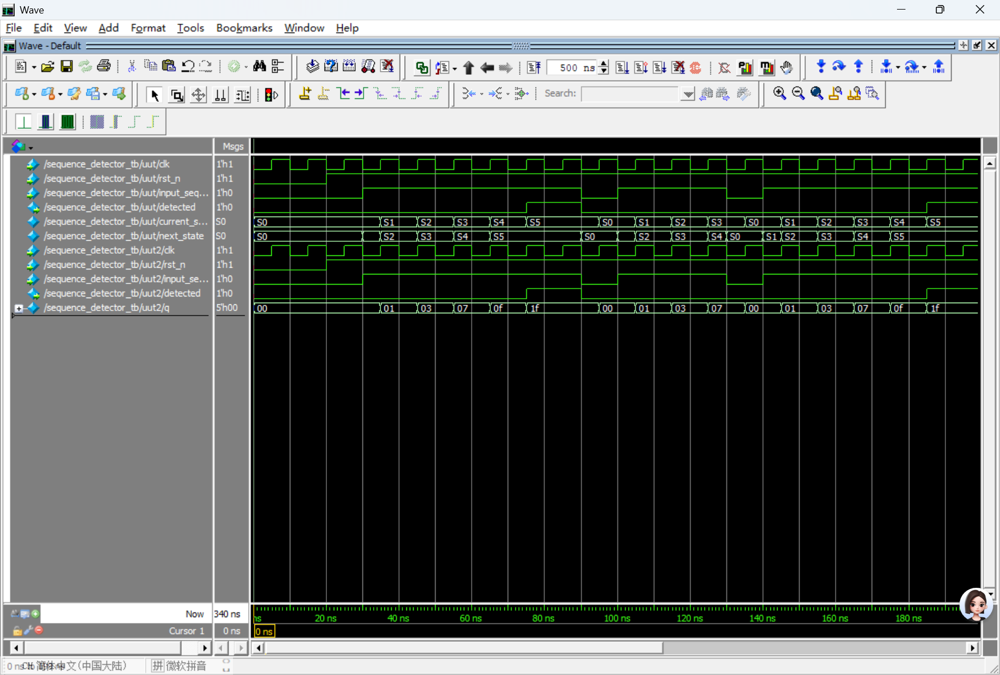

# Question 1


## 1. Mealy FSM
Because the output *detected* is based on both of the current state and the input *input_sequence*.


## 2. State diagram

| State | description               |
|--------|------------------------|
| S0     |  0 consecutive ones was detected |  
| S1     | 1 consecutive ones was detected               | 
| S2     | 2 consecutive ones was detected               | 
| S3     | 3 consecutive ones was detected               | 
| S4     | 4 consecutive ones was detected               | 
| S5     | 5 or more consecutive ones was detected, detected=1| 

### Diagram
```
reset(rst_n=0)→ S0
S0:
  input_sequence 0 → S0(detected 0);
  input_sequence 1 → S1(detected 0)
S1:
  input_sequence 0 → S0(detected 0);
  input_sequence 1 → S2(detected 0)
S2:
  input_sequence 0 → S0(detected 0);
  input_sequence 1 → S3(detected 0)
S3:
  input_sequence 0 → S0(detected 0);
  input_sequence 1 → S4(detected 0)
S4:
  input_sequence 0 → S0(detected 0);
  input_sequence 1 → S5(detected 1)
S5:
  input_sequence 0 → S0(detected 0);
  input_sequence 1 → S5(detected 1)
```


## 3. Derive the next state logic using D flops
Five D flip-flops are used to ensure that detected=1 is output only when the 5th consecutive 1 arrives.


q[0] = whether the current input is 1

q[1] = whether both the current and the previous cycle are 1

q[2] = whether the current and the previous two cycles are all 1

q[3] = whether the current and the previous three cycles are all 1

q[4] = whether the current and the previous four cycles are all 1

detected = when both q[4] and the current input are 1, it indicates 5 consecutive 1s


## 4. in source code


## 5. in source code


## 6. result

