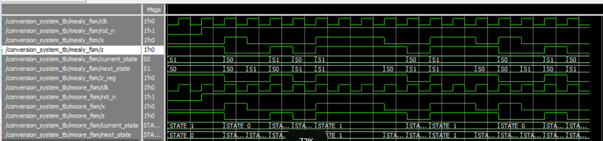

# Question 2
## 1. Mealy FSM Diagram
```
S0 --(x=0 / z=1)--> S1
S0 --(x=1 / z=0)--> S0
S1 --(x=0 / z=0)--> S0
S1 --(x=1 / z=1)--> S1
```
## 2. Moore FSM Diagram
```
STATE_0 --(x=0)--> STATE_1
STATE_0 --(x=1)--> STATE_0
STATE_1 --(x=0)--> STATE_0
STATE_1 --(x=1)--> STATE_1
```
## 3. Code
## 4. Code
