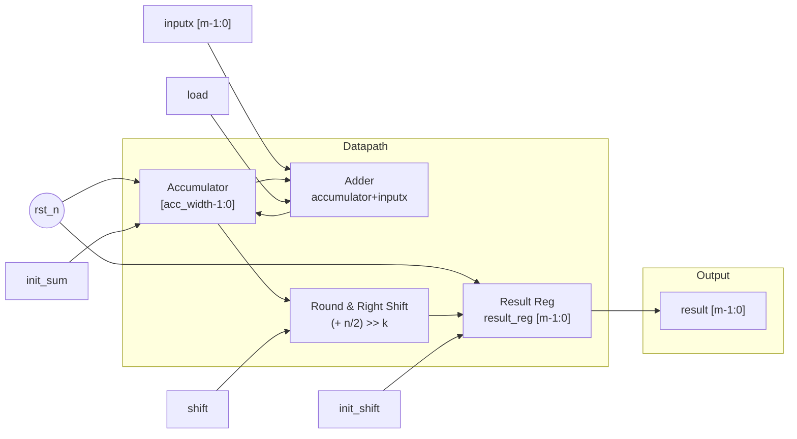
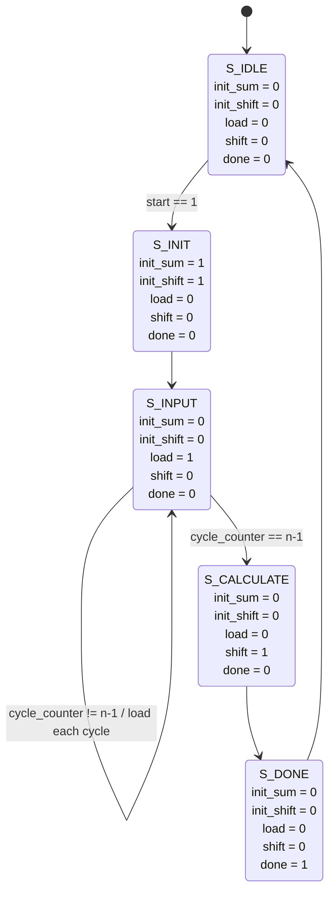
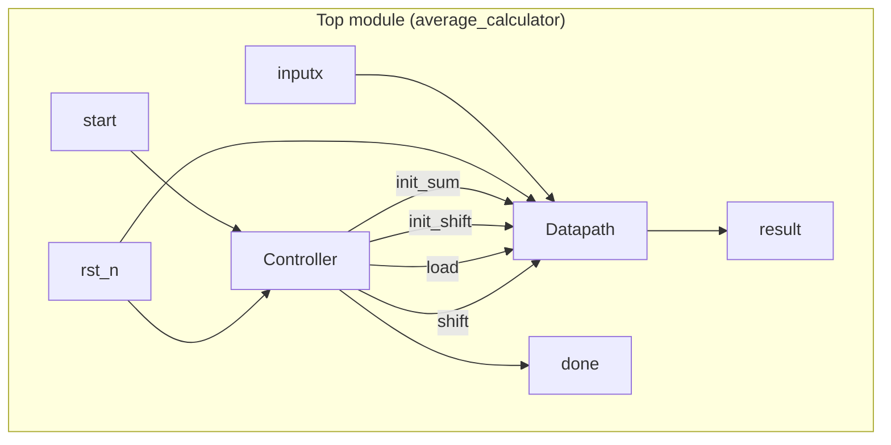
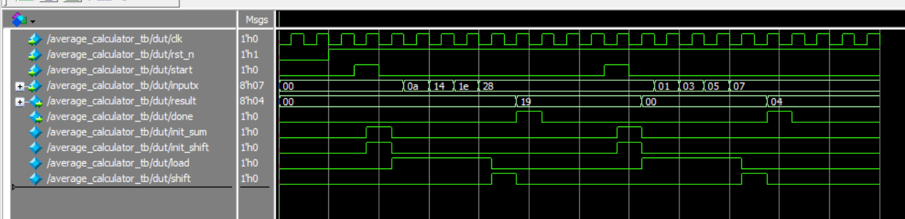

# Question 4
## 1. Datapath

```mermaid
flowchart LR
  
    rst_n((rst_n))
    inputx["inputx [m-1:0]"]
    load["load"]
    shift["shift"]
    init_sum["init_sum"]
    init_shift["init_shift"]
  

  subgraph Datapath
    ADD["Adder
    accumulator+inputx"]
    A_ACC["Accumulator
    [acc_width-1:0]"]    
    RSHIFT["Round & Right Shift
    (+ n/2) >> k"]
    R_REG["Result Reg
    result_reg [m-1:0]"]
  end

  subgraph Output
    result["result [m-1:0]"]
  end

  rst_n --> A_ACC
  rst_n --> R_REG

  inputx --> ADD
  ADD --> A_ACC
  A_ACC --> ADD
  A_ACC --> RSHIFT
  RSHIFT --> R_REG
  R_REG --> result

  load --> ADD
  init_sum --> A_ACC
  shift --> RSHIFT
  init_shift --> R_REG


```
## 2. FSM

```mermaid
stateDiagram-v2
  direction TB

  [*] --> S_IDLE

  state "
  S_IDLE
  init_sum = 0
  init_shift = 0
  load = 0
  shift = 0
  done = 0" as S_IDLE

  state "
  S_INIT
  init_sum = 1
  init_shift = 1
  load = 0
  shift = 0
  done = 0" as S_INIT

  state "
  S_INPUT
  init_sum = 0
  init_shift = 0
  load = 1
  shift = 0
  done = 0" as S_INPUT

  state "
  S_CALCULATE
  init_sum = 0
  init_shift = 0
  load = 0
  shift = 1
  done = 0" as S_CALCULATE

  state "
  S_DONE
  init_sum = 0
  init_shift = 0
  load = 0
  shift = 0
  done = 1" as S_DONE

  S_IDLE --> S_INIT: start == 1
  S_INIT --> S_INPUT
  S_INPUT --> S_INPUT: cycle_counter != n-1 / load each cycle
  S_INPUT --> S_CALCULATE: cycle_counter == n-1
  S_CALCULATE --> S_DONE 
  S_DONE --> S_IDLE
```
##  3. Top-level wiring

```mermaid
graph TD
    subgraph "Top module (average_calculator)"
        %% Ports
        start_in[start]
        inputx_in[inputx]
        rst_n_in[rst_n]
        result_out[result]
        done_out[done]

        %% Modules
        Controller
        Datapath

        %% Wiring
        start_in --> Controller
        inputx_in --> Datapath
        rst_n_in --> Controller
        rst_n_in --> Datapath
        
        
        Controller -- "init_sum" --> Datapath
        Controller -- "init_shift" --> Datapath
        Controller -- "load" --> Datapath
        Controller -- "shift" --> Datapath
        
        
        Controller --> done_out
        Datapath --> result_out
    end
``` 
## 6. Verification
